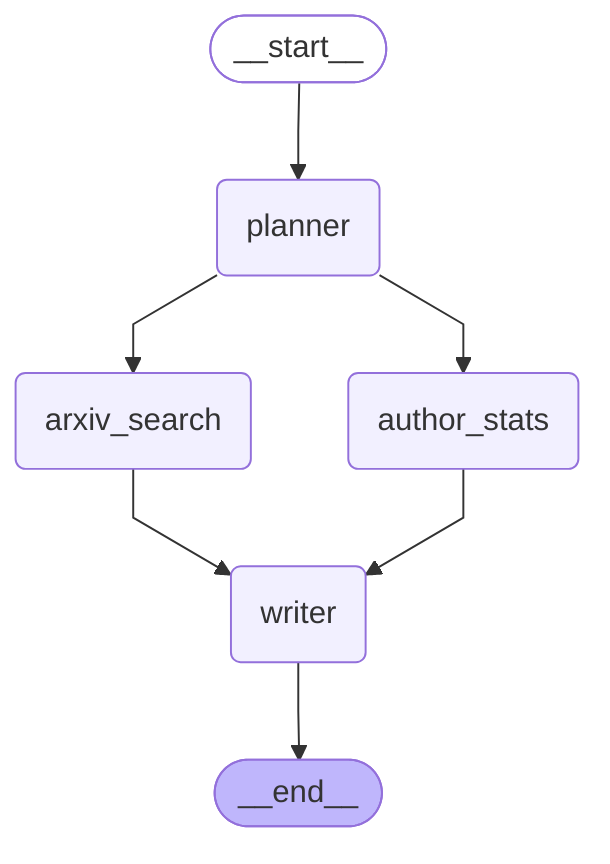

```mermaid
---
config:
  flowchart:
    curve: linear
---
graph TD;
        __start__([<p>__start__</p>]):::first
        planner(planner)
        arxiv_search(arxiv_search)
        author_stats(author_stats)
        writer(writer)
        __end__([<p>__end__</p>]):::last
        __start__ --> planner;
        arxiv_search --> writer;
        author_stats --> writer;
        planner --> arxiv_search;
        planner --> author_stats;
        writer --> __end__;
        classDef default fill:#f2f0ff,line-height:1.2
        classDef first fill-opacity:0
        classDef last fill:#bfb6fc
```
