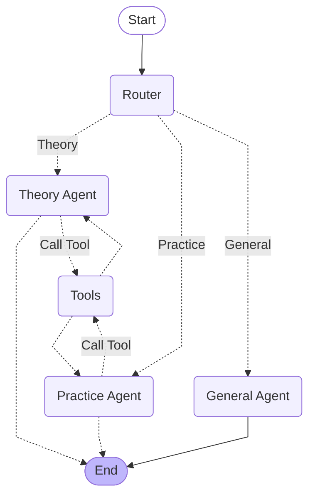

# Lab 2: Multi-Agent Music Tutor

## Overview
This project implements a **Multi-Agent System (MAS)** as a **Musical Tutor**. It helps users with music theory, practice planning, and chord information using specialized agents.

## Features
*   **Router Agent**: Classifies queries into Theory, Practice, or General categories.
*   **Music Theory Agent**: Explains concepts like scales, intervals, and history using a local knowledge base.
*   **Practice Coach Agent**: Generates random practice routines and looks up chord notes.
*   **General Agent**: Handles casual conversation.

## Architecture
Stateful graph with explicit routing:
Stateful graph with explicit routing:



## Usage
```bash
python notebooks/demo.py
```
