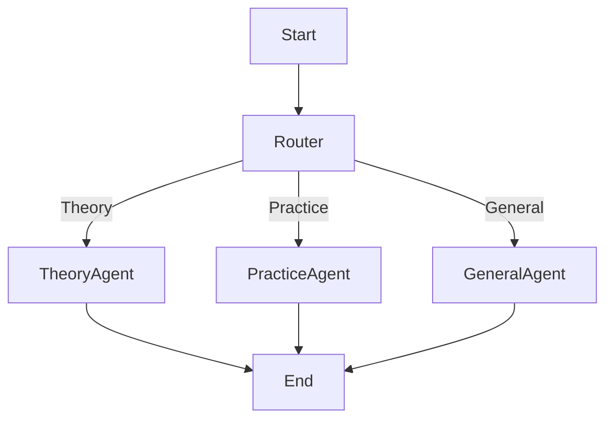

# Lab 2: Musical Tutor - Design Document

## 1. System Overview
The "Musical Tutor" is a multi-agent system designed to assist musicians. It leverages a **Router** pattern to dispatch queries to specialized workers.

## 2. Agents
1.  **Router Agent**:
    *   **Role**: Intent classification.
    *   **Destinations**: `theory_agent`, `practice_agent`, `general_agent`.
2.  **Music Theory Agent**:
    *   **Role**: Academic tutor for music theory.
    *   **Tools**: `search_music_theory(query)`.
3.  **Practice Coach Agent** (formerly Planner):
    *   **Role**: Managing practice sessions and quick lookups.
    *   **Tools**: `suggest_practice_routine(instrument, duration)`, `get_chord_notes(chord)`.

## 3. Control Flow

